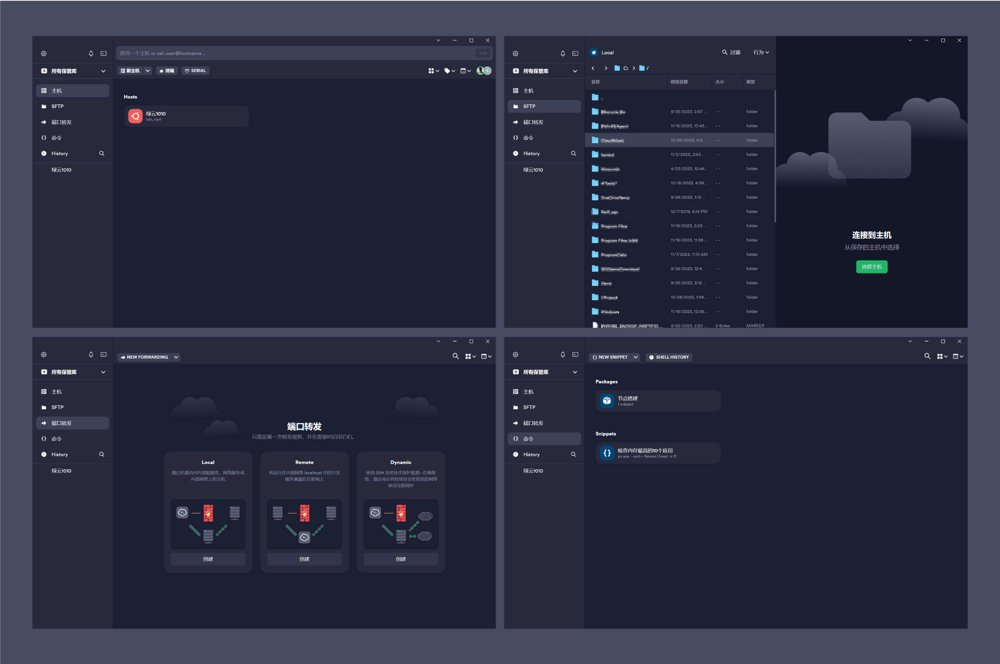
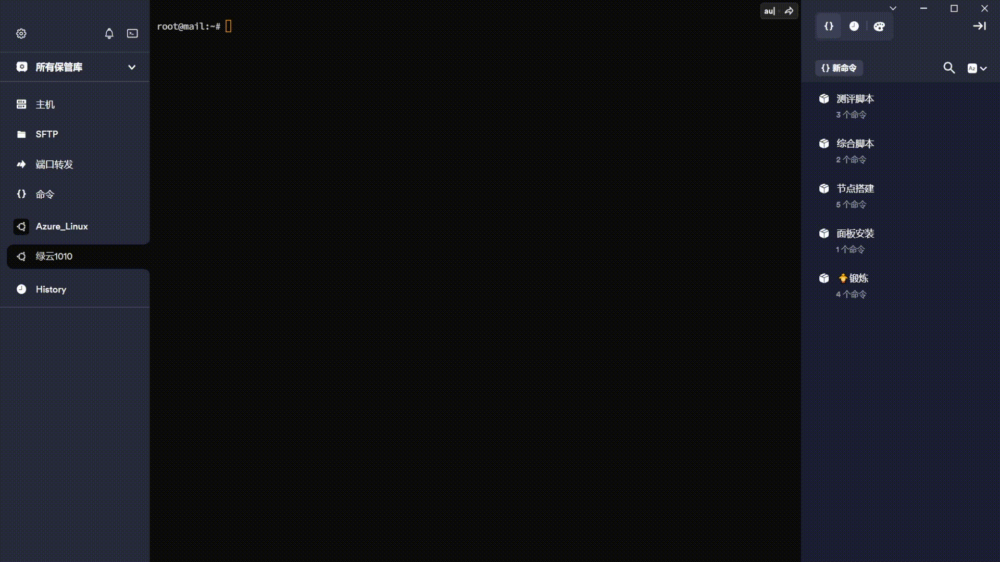

# Termius 中文补丁包项目介绍 🌏
## ⭐如果你喜欢此项目,请留下一个Star⭐
## 项目概述 📖
Termius 是一个非常美观且好用的远程SSH工具,无奈官方不支持中文,于是Termius中文补丁包诞生了

## 主要特性 ✨
- **主功能界面翻译**：本补丁包已完成Termius主要功能界面的中文翻译
- **易于安装**：补丁包的安装过程简单明了，用户可以轻松地将其应用到Termius软件上。

## 下载补丁包 ⏬
- [**点击下载**](./Termius-Chinese-Patch.zip)
- **压缩包解压密码: dooo.ng**
## 安装教程 🔧
1. 下载补丁压缩包。
2. 解压压缩包，找到 `app.asar` 文件。
3. 找到Termius安装目录，通常位置为 `C:\Users\你的用户名\AppData\Local\Programs\Termius`。
4. 在Termius目录下找到 `\resources\` 文件夹。
5. 将解压得到的 `app.asar` 文件覆盖到 `\resources\` 文件夹内的 `app.asar` 文件。
6. 重启Termius软件，享受中文界面。

## 项目截图 📸
  

**AI功能展示:**  
  

## 项目状态 🚀
- 目前项目为非开源状态，仅供分享。
- 该补丁包目前只翻译了Termius的主功能界面
- 由于设置界面需要考虑到完整性和Termius官方的加密的翻译尚在进行中。

## 注意事项 ⚠️
- 使用本补丁包可能会影响Termius软件的正常更新。
- 在安装补丁包之前，请确保备份您的Termius配置和数据。

## 贡献与支持 💬
由于本项目目前不开源，因此不接受代码贡献。但用户的反馈和建议总是受欢迎的。如果您有任何问题或建议，请通过以下方式联系我们：

- Telegram：[WizisCool](https://t.me/WizisCool)
- 个人网站:  [dooo.ng](https://dooo.ng)

---

*本项目与Termius官方无关，仅为社区贡献者个人行为。使用本补丁包可能存在风险，请用户谨慎决定是否安装。*
